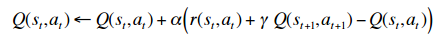
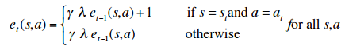
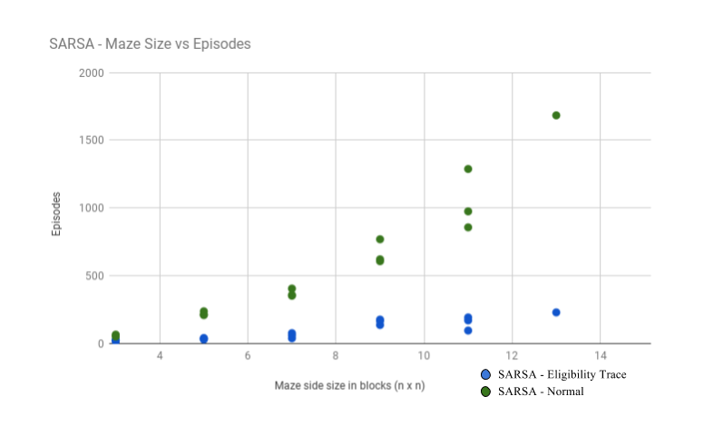

## Video

## Project Summary
Over the duration of this project course, we created an agent that learn to solve arbitrary mazes. Our representation of a maze in the Malmo environment consists of dirt blocks over a floor of lava. The agent's objective is to navigate over the dirt blocks to a single lapis block the “goal block” which denotes the end of the maze. These mazes were generated randomly using our implementation of the randomized Prim-Jarnik minimum spanning tree algorithm which typically produces mazes that are difficult to solve.

The Markov Decision Process (MDP) we used to model the environment is comparable to a gridworld. Each block of the maze is represented as a coordinate position (a tuple of integers which are in the form (int+0.5, int+0.5) in the actual code) on a grid. The size of the grid is nxn and can be varied by the user to create mazes of different sizes for the agent to solve. Each state is a position on the grid and an agent can transition to a future state by moving one block at a time in either the north, south, east or west direction. The agent’s actions are restricted to a move in any of these four directions and of the form “move [direction] 1" (i.e. strings, which are discrete Malmo movement commands). The action set for a state contains only the actions that are executable from that state (coordinate position). An episode in the MDP ends when the agent reaches the goal block or dies by entering lava. 

The agent’s percepts are highly limited in that it only knows its current position (the coordinate position of the grid). Consequently, the agent has no field of vision and does not know if there is a goal state. With this restriction of available information in our problem definition, our agent must learn how to solve the maze by explorating the unknown environment and storing associated reward values for the sequences of actions it takes. The closer the agent gets to the goal the higher the reward value. Thus, our agent iterates through multiple episodes on the same maze eventually learning a sequence of actions that will obtain the maximum reward. 
 
We first implemented an on-policy learning algorithm called the State-Action-Reward-State-Action (Sarsa) algorithm to learn the MDP policy. This was completed and analyzed in our status report (status.md). To build upon our approach we decided to implement another on-policy learning algorithm called Sarsa(lambda), which adds “eligibility traces" to the Sarsa algorithm. This allowed us to strengthen our evaluation of our Sarsa algorithm by comparing the results we obtained from Sarsa with the data we collected from the Sarsa(lambda) algorithm. 

## Approaches
We will provide a brief recap of how the Sarsa algorithm is able to solve mazes in the Malmo environment. A more detailed description can be seen in our “Approach” section of our status report. We continue with an explanation of the Sarsa(lambda) algorithm, which was implemented after the status report.  

Our problem definition requires our agent to learn in a gridworld where it only knows its current position and can take actions that will allow it to move a single block north, south, east, or west. Our base algorithm is the "Sarsa algorithm" (which we will henceforth call "plain Sarsa" to distinguish it from the "Sarsa(lambda)" algorithm discussed later), which the agent uses to learn the optimal MDP policy, which is simply a sequence of actions that maximize the summation of future rewards. For each visited state at time step t the agent updates the Q values (adding new states to the Q table as they are discovered) according to the following update rule provided by the Sarsa algorithm:

where s(t+1) is the state arrived at by taking action a(t) from s(t), and a(t+1) is the action chosen from state s(t+1) according to an epsilon greedy policy. As usual, r denotes the reward, alpha functions as learning rate, and gamma functions as the discount factor. Our epsilon-greedy policy randomly chooses an action from state s with probability 1/N(s) where N(s) is the number of times we've visited state s, and otherwise chooses an action greedily. We also discussed the crucial "Manhattan distance" heuristic we endowed the agent with, in which we discount states by their distance from the start state, in order to encourage the agent to move in the direction of the goal.

Everything described thus far is implemented in the file "sarsa1.py", with miniscule changes since the status report.

The mazes are generated using a randomized Prim-Jarnik minimum spanning tree algorithm, as described here: https://en.wikipedia.org/wiki/Maze_generation_algorithm#Randomized_Prim.27s_algorithm. This is implemented in maze_gen2.py (and subsequently called in the malmo files).

We implemented a new algorithm, Sarsa(lambda), which incorporats the notion of "eligibility traces." We maintain an "E table" containing an entry for every state-action pair, and the value associated with an entry measures how "eligible" a state-action pair is for the reward obtained at a current state. The E table is updated for every used state-action pair after every action according to the following equation:

We increment the E table entry for a state-action pair any time we use it and otherwise update it according to the following update equation: 

E(s,a) = gamma\*lambda\*E(s,a)

where gamma is the same discount factor described before and lambda is a parameter (between 0 and 1) that controls how much "credit" we would like to give to states in the past. As a result of these update equations, the E table entry for s and a (The "eligibility trace" for s/a) measures "how far away" a given previously used state-action pair is from a current state s'. With this, we can take the reward for s' and not only update Q table for the previous state, but every visited state s up to that point with the following equation:

Q(s,a) = Q(s,a) + alpha\*(r + gamma\*Q(s',a') - Q(s, a))\*E(s,a)

which is the same update equation for plain Sarsa except that the error is multiplied by the eligibility trace for s/a. Thanks to the manner in which eligibility traces are updated, we change the Q value for s/a by an amount inversely proportional to "how far back in the past" it is (which is what our E table measures). In other words, we "attribute" the reward gained at the current state to s based on how far back in the past it was. A state-action pair is "more eligible" for the reward gained at the current state if it was more closely related to it. Note: The eligibility trace is higher not only if the state was more recently visited, but more frequently visited. Our agent does not repeat states that often (though sometimes it does) so we are more focused on the "time"-based factor of it.

This is implemented in the file "sarsalambda1.py" All in all, this required only a few additional lines of code to the original Sarsa algorithm (In fact, we could have consolidated plain Sarsa and Sarsa(lambda) into one file). However, it made a huge difference in the agent's performance as discussed in the Evaluation section.
 
## Evaluation
In contrast to our evaluation from the status report, we have gathered additional data, and now have comparisons to make. We measure the performance of our agent based on the number of episodes it takes to converge, where we define "convergence" as reaching the goal state 3 times in a row.

The following graph says it all:

Above rewritten (In order to further analyze and interpret the results that we had obtained from running our Sarsa algorithm, we gathered data on our Sarsa(lambda) algorithm and compared their statistics. 
Our primary evaluation measure was examining the performance of each agent. We defined “convergence” as reaching the goal state 3 times in a row and recorded the number of episodes the agent takes to converge. We tested this with numerous iterations on both algorithms and took the average number of episodes that a given agent and environment took to converge. We also varied the environment size, all of which is displayed in the following graph:)

Sarsa(lambda) appears to drastically outperform plain Sarsa on our MDP. The intuitive reasoning for this, we believe, is simply that eligibility traces allow the reward for a given state to propogate backwards. Consider the following toy example:

Above rewritten (Sarsa(lambda) appears to drastically outperform plain Sarsa on our Markov Decision Process. Our intuition leads us to believe that the reasoning for this outcome is that eligibility traces allow the reward for a given state to propagate backwards. Let us examine a simple example that demonstrates the property of backtracking to previous states if a path results in a poor reward. 
Consider the environment pictured below, where the red box is lava and the white boxes signify the dirt blocks of the maze. Recall that our agent starts in the state (0,0) and has the objective to end in the goal block (marked in green).)

Obviously, the better decision from the start state is to move north to the goal (marked in green) than moving east to a dead-end (lava). Suppose the agent tends to move all the way east and fall into the lava (moving east from the start state, falling into (6,0) is the actually best option). In Sarsa(lambda), the negative reward obtained from doing so immediately propogates back to the state-action pair (0,0)-east, as an immediate consequence of the update rule. Hence, the agent sees that (0,0)-east (and likewise, (1,0)-east, (2,0)-east, etc.) is a bad idea quite quickly, and will prefer to try going north instead sooner. On the other hand, in plain Sarsa, only the state-action pair (5,0)-east immediately gets the negative reward. For the negative reward to propogate back to (0,0)-east the agent has to revisit (5,0)-east, which updates the value for (4,0)-east, restart, then revisit (4,0)-east, which updates the value for (3,0)-east, then revisit (3,0)-east, etc. Thus, it can take up to 5 extra episodes for (0,0)-east to be properly updated in Sarsa, while for Sarsa(lambda) it only takes 1 (Likewise, the positive reward obtained at the goal state propogates back faster in Sarsa(lambda) than it does for Sarsa). Now consider this for not just the start state, but every position in the maze, and it becomes clear why Sarsa(lambda) takes much fewer episodes to converge.

We noted in our status report that we would like to test our agent(s) on larger maze sizes. As it turns out, this is exactly where we started to run into problems. Specifically, for maze sizes 13x13 and beyond, the agents (particularly Sarsa(lambda)) would get stuck in "local minima"; the agent would start to go back and forth between two states repeatedly until the episode ends, and repeat this episode after episode, thus failing to converge in any reasonable time. We are quite certain that this is due to the discounting factor gamma. The agent finds that if it goes back and forth endlessly between two states, its discounted reward for those states would be gamma^n\*r where n is the number of actions it can take within a given episode (which is quite large). Since gamma is between 0 and 1, this pushes the discounted reward for those states towards 0, and since every state other than the goal state yields negative reward, this is "good" from the agent's point of view. Thus it would get stuck in pockets where it just goes back and forth. We confirmed this further when we increased gamma from 0.9 to 0.99999. Having increased gamma in this manner, the agent no longer exhibited the back-and-forth behavior and--as far as we had tested--managed to converge on larger maze sizes. However, we did not gather enough data to incorporate this into the graph above, as these were technically "different" agents from those depicted in the graph (since they had different gamma values) and we would have to recollect data for these agents on all the maze sizes. Hence, we believe qualitatively that this sort of increase in gamma would allow our agent to scale to larger sizes to a reasonable extent (The other necessary change would be to scale up the rewards by a certain factor, which is simple enough).

## References

Introduction to Reinforcement Learning, 3rd Edition. Richard S. Sutton and Andrew G. Barto

https://en.wikipedia.org/wiki/Maze_generation_algorithm#Randomized_Prim.27s_algorithm
